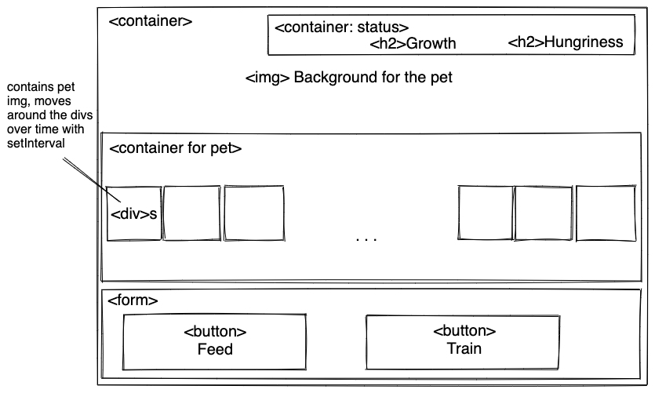
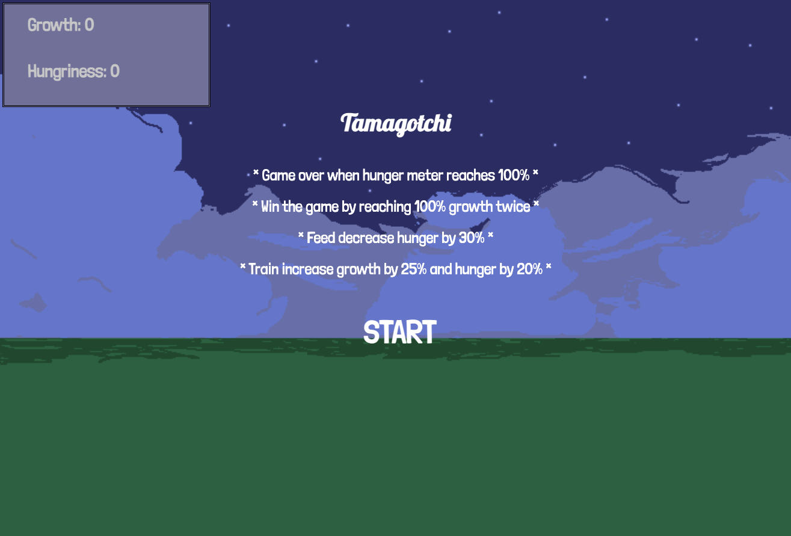
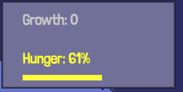
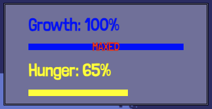

  # Title & Blurb
  ##  Tamagachi
    To see it grow and evovle as you play the game. 
    Use feed, train, and sleep functions correctly to win the game. 
    Game over when hunger meter reaches 100%.
  
  ## Motivation
    Used to play this game when I was a kid, 
    so I want to see if I could build one with the skills I've learned.
  

  # Wireframe
  
  ## Examples
  ### Start page
  

  ### Hunger Meter
  

  ### Growth Meter
  

  ### Buttons
  

  ### Game Over
  

  # Basic
    The webpage will display a background,
    with a section at the top for displaying the status of the pet.
    Actions will be availabe to user as buttons on the bottom of the page.
    The pet will be moving around within the container using css.
  

  # Functions
  ## Feed
    When user click feed, the Hunger meter will be reduced by a set amount of value.
    The pet img will change to a different set of imgs, to look like it is eating. 

  ## Train
    Same concept with feed function,
    but will increase both the Growth and Hunger.

  ## Hunger
    Hungriness will increase over time, using setInterval.
    When Hunger reaches 100%, game will be over.

  ## Growth
    Growth can be increased by using the Train function.
    When it reaches 100%, change to a different set of pet imgs,
    to indicate the pet has evovled and reset Growth to 0.
    Will probably only include one evolution,
    when Growth reaches its second 100%, log "You won"

  # Features
  * Two bars that grow according to the Growth and Hunger meters, as well as changing color depending on the value.
  * Added cooldowns for buttons so they can only be clicked once every other set duration.
  * Most of the contents are reponsive, resize as window size changes including font size.
  * Change styles in different circumstances, including change the color and wording for Train button to show that evolve or ascend is available.